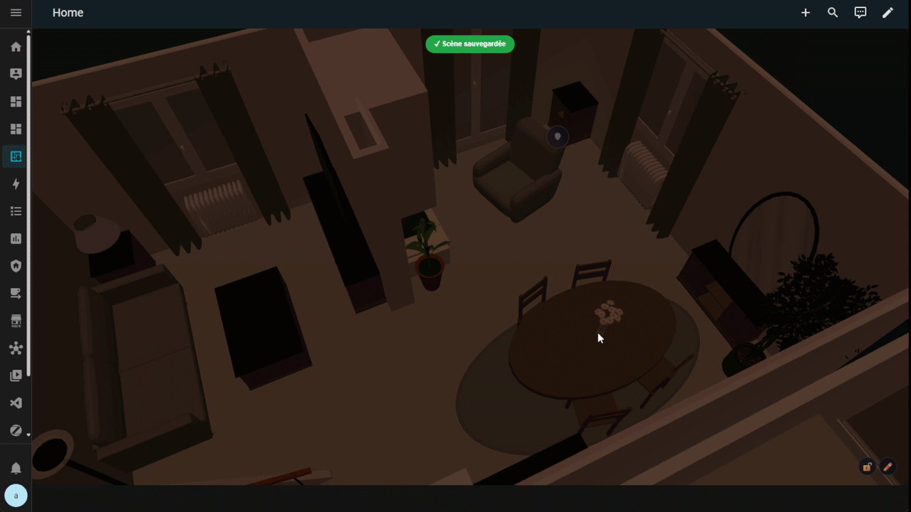
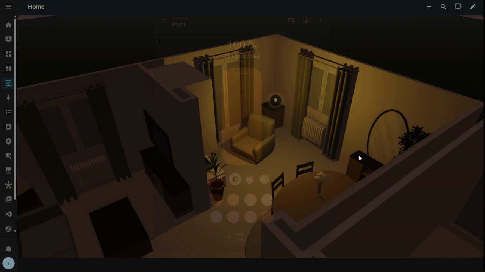
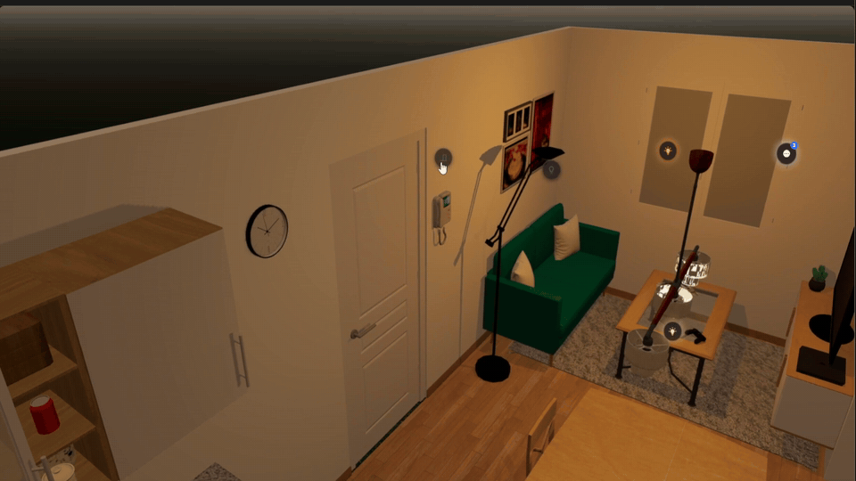
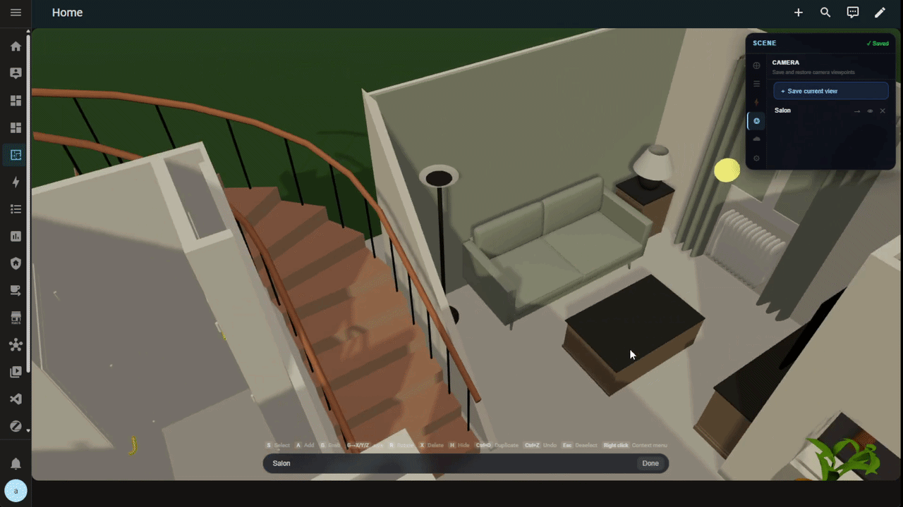
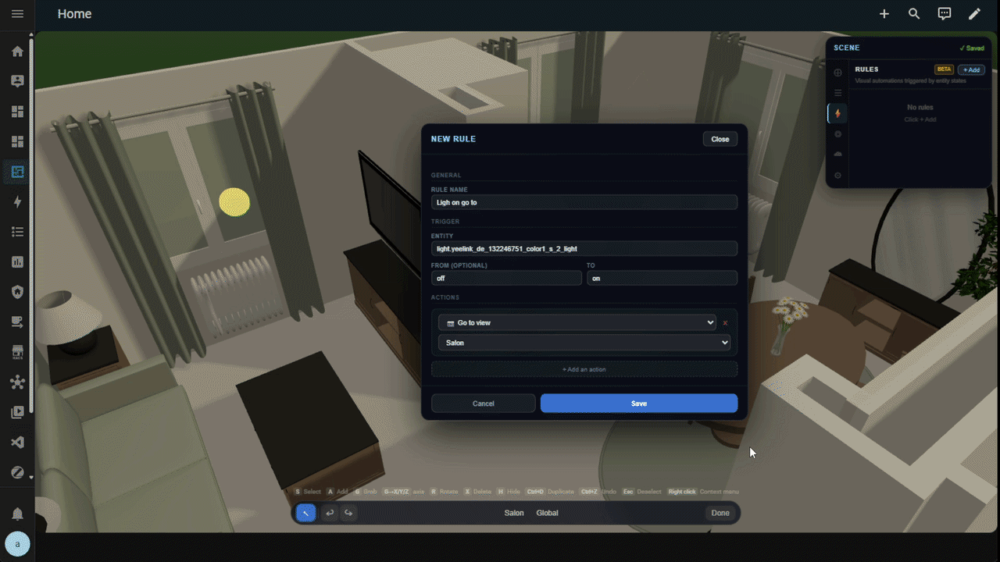
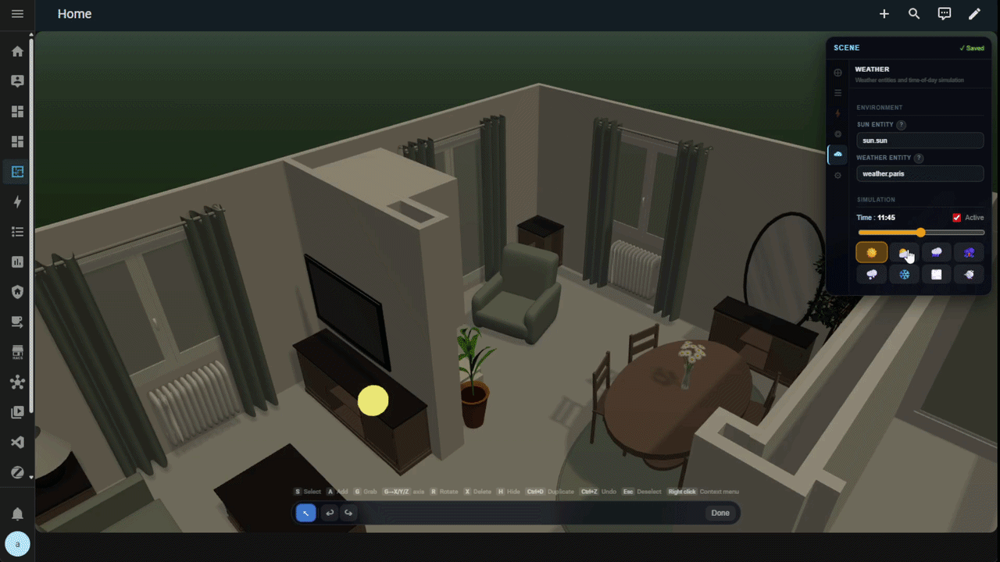

<p align="center">
  
</p>

<h1 align="center">Owlnest</h1>

<p align="center">
  <strong>Un plan 3D pour Home Assistant.</strong><br />
  Vos lumières et vos appareils dans un modèle de votre maison, avec un éditeur pour les placer.
</p>

<p align="center">
  <a href="https://github.com/MestrieEsteban/ha-owlnest/releases/latest"></a>
  <a href="#installation"></a>
  <a href="https://github.com/MestrieEsteban/ha-owlnest/issues"></a>
  <a href="LICENSE"></a>
</p>

<p align="center">
  <a href="https://mestrieesteban.github.io/ha-owlnest/?lang=fr"></a>
</p>

<p align="center">
  <a href="https://mestrieesteban.github.io/ha-owlnest/?lang=fr"><strong>▶ Démo en ligne</strong></a> ·
  <a href="#installation">Installer</a> ·
  <a href="#premiers-pas">Essayer</a> ·
  <a href="docs/guide-fr.md">Guide complet</a> ·
  <a href="https://www.youtube.com/watch?v=_MbcDL5JaTE">Démo vidéo</a> ·
  <a href="README.md">English</a>
</p>

<p align="center">
  <a href="https://www.youtube.com/watch?v=_MbcDL5JaTE">
    
  </a>
</p>

Owlnest est une carte Home Assistant qui affiche votre logement en 3D. Les lumières du modèle suivent vos vraies lampes : allumage, couleur et intensité. Vous pouvez aussi y placer vos capteurs et faire bouger les portes ou les volets selon leur état.

**Votre logement en un geste :** glissez votre export Sweet Home 3D sur la carte. Il est converti dans votre navigateur, ses portes et fenêtres sont repérées et réglées, et il s'affiche aussitôt. Pas de Blender, pas de convertisseur, aucun fichier à copier.

## Pourquoi Owlnest ?

Les solutions de plan 3D pour Home Assistant reposent sur des rendus Blender statiques : une image par état de lumière, un nouveau rendu à chaque couleur ou condition. Rien d'interactif, rien de vivant.

J'ai voulu autre chose : des lumières 3D temps réel, un éditeur visuel, de la météo, des animations. Tout ce que j'aurais aimé trouver. Et je me suis dit que d'autres étaient peut-être dans le même cas, alors j'ai partagé.

Une maison de démo est fournie pour essayer la carte avec vos propres lumières, même si vous n'avez pas encore de modèle.

> **Bêta :** le projet est encore en développement, il reste des bugs et des réglages peuvent changer. Si vous avez un souci, vous pouvez le signaler dans les [issues](https://github.com/MestrieEsteban/ha-owlnest/issues).

## Fonctionnalités

| Fonctionnalité | Détail |
|---|---|
| Import | Glissez un export Sweet Home 3D (dossier, fichiers ou zip) ou un `.glb` sur la carte. Portes et fenêtres sont repérées et réglées pour vous ; un plan lourd peut être allégé pour une tablette murale. |
| Lumières | Allumage, intensité et couleur synchronisés avec les entités `light.*`. |
| Portes et volets | Rotation, glissement, déroulement ou lecture des animations du GLB. |
| Capteurs | Valeurs affichées à l'endroit où vous placez les ancres. |
| Commandes | Clic sur une ancre pour piloter l'appareil, appui long pour ouvrir ses détails. L'action dépend du type d'entité. |
| Règles | Déplacement de la caméra, mise en évidence d'une ancre ou message selon l'état d'une entité. |
| Météo et soleil | Éclairage lié à `sun.sun`, pluie, neige, brouillard et orages liés à votre entité météo. |
| Murs | Les objets qui cachent les pièces s'effacent lorsque vous tournez autour du modèle. |
| Navigation | Souris, tactile et points de vue enregistrés. |

Les ancres prennent en charge `light`, `switch`, `sensor`, `binary_sensor`, `cover`, `climate` et `media_player`. L'interface est disponible en français et en anglais.

## En action

<table>
  <tr>
    <th colspan="2">Lumières synchronisées en temps réel</th>
  </tr>
  <tr>
    <td colspan="2" align="center"></td>
  </tr>
  <tr>
    <td colspan="2">Quand une lampe s'allume ou change de couleur, la lumière dans le modèle suit. Vous pouvez aussi la commander depuis son ancre. <a href="docs/guide-fr.md#ancres">Réglages des lumières →</a></td>
  </tr>
  <tr>
    <th>Placement des appareils</th>
    <th>Portes et volets</th>
  </tr>
  <tr>
    <td></td>
    <td></td>
  </tr>
  <tr>
    <td>Les ancres se placent sur le modèle et se déplacent dans l'éditeur. Chacune peut être reliée à une entité. <a href="docs/guide-fr.md#ancres">Guide des ancres →</a></td>
    <td>Une porte ou un volet bouge avec son entité. Le mouvement se règle et se teste dans l'éditeur. <a href="docs/guide-fr.md#ouvrants">Guide des ouvrants →</a></td>
  </tr>
  <tr>
    <th>Vues caméra</th>
    <th>Règles</th>
  </tr>
  <tr>
    <td></td>
    <td></td>
  </tr>
  <tr>
    <td>Vous pouvez enregistrer un point de vue pour y revenir plus tard. <a href="docs/guide-fr.md#vues-caméra">Guide des vues caméra →</a></td>
    <td>Par exemple, un capteur de mouvement peut déclencher le passage à la vue de la pièce. <a href="docs/guide-fr.md#moteur-de-règles">Guide des règles →</a></td>
  </tr>
  <tr>
    <th colspan="2">Météo et soleil</th>
  </tr>
  <tr>
    <td colspan="2" align="center"></td>
  </tr>
  <tr>
    <td colspan="2">Le soleil suit <code>sun.sun</code>. La pluie, la neige et le brouillard dépendent de votre entité météo. <a href="docs/guide-fr.md#environnement">Réglages de l'environnement →</a></td>
  </tr>
</table>

<p align="center">
  <a href="https://mestrieesteban.github.io/ha-owlnest/?lang=fr"></a>
</p>

## Installation

**Home Assistant 2024.1 ou supérieur est requis.** Owlnest s'installe comme une intégration et embarque sa carte Lovelace. La carte est déclarée automatiquement.

### Avec HACS

Le plus rapide : ces deux boutons ouvrent votre propre Home Assistant à la bonne page. [▶ Voir la vidéo d'installation](https://www.youtube.com/watch?v=iBREyrejHSo) (1 min 30, en anglais).

[](https://my.home-assistant.io/redirect/hacs_repository/?owner=MestrieEsteban&repository=ha-owlnest&category=integration)

[](https://my.home-assistant.io/redirect/config_flow_start/?domain=owlnest)

1. Cliquez sur le premier bouton, confirmez l'ajout du dépôt, puis **Télécharger**.
2. **Redémarrez Home Assistant**.
3. Cliquez sur le second bouton et validez.
4. Rechargez le navigateur en forçant le cache avec **Ctrl+Maj+R** (**Cmd+Maj+R** sur macOS).

<details>
<summary><strong>Sans les boutons</strong></summary>

1. Dans **HACS**, ouvrez **⋮ → Dépôts personnalisés**.
2. Ajoutez `https://github.com/MestrieEsteban/ha-owlnest` et choisissez la catégorie **Intégration**.
3. Cherchez **Owlnest** dans HACS et téléchargez-le.
4. **Redémarrez Home Assistant**.
5. Allez dans **Paramètres → Appareils et services → Ajouter une intégration**, cherchez **Owlnest** et validez.
6. Rechargez le navigateur en forçant le cache avec **Ctrl+Maj+R** (**Cmd+Maj+R** sur macOS).

</details>

> Choisissez la catégorie **Intégration** dans HACS. La carte est livrée à l'intérieur de l'intégration : aucun téléchargement séparé ni ressource Lovelace à ajouter.

<details>
<summary><strong>Installation manuelle</strong></summary>

1. Téléchargez l'archive des sources de la [dernière version](https://github.com/MestrieEsteban/ha-owlnest/releases/latest).
2. Copiez son dossier `custom_components/owlnest/` dans le répertoire `config/custom_components/` de Home Assistant, en incluant le dossier `frontend/`.
3. Redémarrez Home Assistant.
4. Ajoutez **Owlnest** depuis **Paramètres → Appareils et services → Ajouter une intégration**.
5. Rechargez le navigateur en forçant le cache.

La carte et le modèle de démonstration sont inclus dans le dossier de l'intégration.

</details>

## Premiers pas

### Essayez la maison de démonstration

Après l'installation, modifiez un tableau de bord et ajoutez une carte **Manuelle** :

```yaml
type: custom:ha-3d-floorplan
scene_id: owlnest_demo
```

Sans `model_url`, Owlnest charge la maison incluse. Cliquez sur un repère **+** d'une lampe ou de la télévision, puis choisissez une de vos entités Home Assistant. La liaison est sauvegardée automatiquement.

Essayez d'allumer une lumière reliée. Vous pouvez aussi glisser pour tourner autour de la maison, utiliser la molette pour zoomer ou naviguer avec les gestes tactiles.

### Utilisez votre logement

Le plus simple est [Sweet Home 3D](https://www.sweethome3d.com/fr/), un logiciel gratuit d'aménagement intérieur.

1. Dans Sweet Home 3D, ouvrez votre logement et choisissez **Vue 3D → Exporter au format OBJ**. Exportez tous les éléments dans un dossier vide.
2. **Glissez ce dossier sur la carte.** Ses fichiers ou un zip fonctionnent aussi. Vous pouvez également cliquer sur **Importer mon plan**, dans le bandeau de la démo ou en haut de l'onglet **Config** de l'éditeur.
3. Si le plan est lourd, la carte propose de l'alléger pour une tablette murale et explique ce que cela change. L'option est décochée par défaut.
4. La carte propose d'ajouter les portes et fenêtres trouvées. Cliquez sur **Les ajouter**, puis choisissez le capteur de chacune dans l'onglet **Ouvrants**.
5. Ouvrez l'éditeur avec le **crayon**. Dans **Ancres**, cliquez sur **+ Ajouter**, cliquez sur le modèle pour placer l'ancre, puis choisissez une entité comme `light.salon`. Les modifications sont sauvegardées automatiquement.

Glisser à nouveau votre plan après l'avoir retouché garde vos ancres, et demande quoi faire de vos ouvrants : les garder, ajouter seulement les nouveaux, ou les remplacer en gardant les capteurs déjà reliés. L'import demande un compte administrateur. [Guide de l'import →](docs/guide-fr.md#importer-votre-plan)

<details>
<summary><strong>Utiliser un GLB fait ailleurs (Blender…)</strong></summary>

Vous pouvez glisser un `.glb` sur la carte de la même façon. Pour le servir vous-même, placez-le dans `config/www/models/` et indiquez-le dans la carte :

```yaml
type: custom:ha-3d-floorplan
scene_id: ma_maison
model_url: /local/models/maison.glb
```

Un plan importé depuis la carte passe devant `model_url`.

</details>

**Astuce d'édition :** appuyez sur **G** pour déplacer une ancre sélectionnée, puis sur **X**, **Y** ou **Z** pour limiter le mouvement à un axe.

## Documentation

| Sujet | Guide |
|---|---|
| Importer un plan Sweet Home 3D ou un GLB | [Importer votre plan](docs/guide-fr.md#importer-votre-plan) |
| Naviguer à la souris ou au tactile | [Navigation dans la scène](docs/guide-fr.md#navigation-dans-la-scène) |
| Configurer les appareils, les étiquettes et leur visibilité | [Ancres](docs/guide-fr.md#ancres) |
| Animer les portes, les volets ou les animations du GLB | [Ouvrants](docs/guide-fr.md#ouvrants) |
| Enregistrer des points de vue et passer de l'un à l'autre | [Vues caméra](docs/guide-fr.md#vues-caméra) |
| Faire réagir la vue aux états des entités | [Moteur de règles](docs/guide-fr.md#moteur-de-règles) |
| Relier le soleil et la météo | [Environnement](docs/guide-fr.md#environnement) |
| Ajuster les ombres, l'exposition et l'apparence de la scène | [Rendu et apparence](docs/guide-fr.md#rendu-et-apparence) |
| Retrouver les raccourcis ou la configuration de la carte | [Raccourcis clavier](docs/guide-fr.md#raccourcis-clavier-mode-édition) · [Référence YAML](docs/guide-fr.md#configuration-yaml-complète) |

## Dépannage

<details>
<summary><strong>« Custom element doesn't exist: ha-3d-floorplan »</strong></summary>

Vérifiez qu'Owlnest a été téléchargé comme une **Intégration** dans HACS, puis redémarrez Home Assistant et ajoutez-le dans **Paramètres → Appareils et services**. Rechargez ensuite le navigateur en forçant le cache.

Si le dépôt a été ajouté dans une autre catégorie, retirez cette entrée de HACS et ajoutez-la à nouveau comme **Intégration**. Pour une installation manuelle, vérifiez la présence de `custom_components/owlnest/frontend/ha-3d-floorplan.js`.

</details>

<details>
<summary><strong>Mon modèle ne s'affiche pas</strong></summary>

Si vous avez glissé votre plan sur la carte et qu'elle indique que l'intégration n'accepte pas les imports, mettez Owlnest à jour dans HACS et redémarrez Home Assistant.

Si vous servez le modèle vous-même, vérifiez que `config/www/models/maison.glb` est accessible à l'adresse `/local/models/maison.glb` sur votre instance Home Assistant. Le nom du fichier et `model_url` doivent correspondre. Pour un GLTF, les textures et fichiers binaires référencés doivent aussi être accessibles à leurs chemins relatifs.

Si le fichier est accessible mais ne se charge toujours pas, consultez l'erreur dans la console du navigateur.

</details>

<details>
<summary><strong>Une lumière ne répond pas, ou les modifications ne se sauvegardent pas</strong></summary>

Pour les lumières, vérifiez que l'ancre est reliée à la bonne entité `light.*` et que celle-ci est disponible dans **Outils de développement → États**.

Pour la sauvegarde, vérifiez que l'intégration Owlnest est active et qu'une scène est sélectionnée avec un `scene_id`. L'indicateur de l'éditeur précise si les modifications sont sauvegardées. Consultez la console du navigateur pour repérer les erreurs WebSocket en cas d'échec.

</details>

<details>
<summary><strong>La scène est lente, ou l'échelle semble incorrecte</strong></summary>

Réduisez le nombre de polygones et la taille des textures du modèle. Dans l'onglet **Config** de l'éditeur, désactivez les ombres et le ciel atmosphérique si nécessaire ; les effets météo inutilisés peuvent aussi être désactivés.

Les modèles peuvent être en mètres, centimètres ou pouces : les effets qui dépendent des distances s'adaptent à la taille globale du modèle. Si les objets sont disproportionnés entre eux, corrigez-les dans votre logiciel 3D avant l'export.

</details>

## Contribuer

Pour signaler un bug ou proposer une fonctionnalité, [ouvrez une issue](https://github.com/MestrieEsteban/ha-owlnest/issues). En cas de bug, ajoutez vos versions de Home Assistant et d'Owlnest, les étapes pour le reproduire et les erreurs du navigateur s'il y en a.

Pour travailler sur le code, consultez [DEVELOPMENT.md](DEVELOPMENT.md) : installation locale, vérifications et développement avec Home Assistant.

## Licence et crédits

[MIT](LICENSE) · Esteban Mestrie.

La maison de démonstration incluse utilise le [Furniture Kit](https://kenney.nl/assets/furniture-kit) de [Kenney](https://kenney.nl), publié sous licence CC0.
