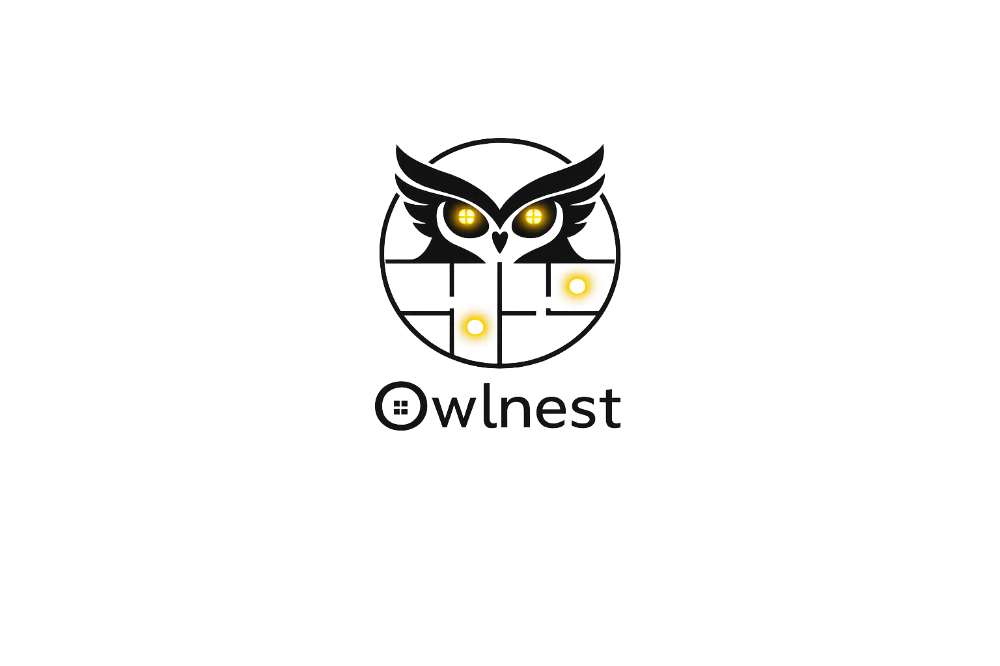

<p align="center">
  
</p>

<h1 style="margin-top:-70px" align="center">Owlnest — 3D Floorplan for Home Assistant</h1>

<p align="center">
  <strong>Interactive 3D visualization of your home, synchronized with your smart devices in real-time.</strong>
</p>

<p align="center">
  <a href="https://github.com/esteban-dev/HA/releases/latest">
    
  </a>
  <a href="https://hacs.xyz">
    
  </a>
  
  
  
</p>

<p align="center">
  <a href="#-features">Features</a> •
  <a href="#-installation">Installation</a> •
  <a href="#%EF%B8%8F-configuration">Configuration</a> •
  <a href="#-anchor-editor">Anchor Editor</a> •
  <a href="#-examples">Examples</a> •
  <a href="docs/CONTRIBUTING.md">Contributing</a>
</p>

---

## ✨ Features

<table>
<tr>
<td width="50%">

### 🏠 3D Model Rendering
Load any `.glb` 3D model of your home. Navigate freely with mouse or touch — rotate, zoom, pan. Camera position is automatically saved and restored between sessions.

</td>
<td width="50%">

### 💡 Live Light Synchronization
Every `light.*` entity becomes a real PointLight in the 3D scene. Brightness, color, and RGB transitions are rendered in real-time with smooth animations.

</td>
</tr>
<tr>
<td width="50%">

### 🌅 Day / Night Cycle
Linked to your `sun.sun` entity — the sky, directional light, and ambient atmosphere automatically evolve with sunrise, sunset, and night. Full Rayleigh scattering simulation.

</td>
<td width="50%">

### 🌧️ Weather Effects
Connect a `weather.*` entity to trigger live particle systems — rain droplets or snowflakes that respond to real weather conditions.

</td>
</tr>
<tr>
<td width="50%">

### 📍 Entity Anchors
Place interactive overlays anywhere on your 3D model — lights, switches, covers, sensors, media players, climate devices. Click to control directly.

</td>
<td width="50%">

### 🖊️ Built-in Visual Editor
No external tools needed. An integrated WYSIWYG editor lets you place, drag (with X/Y/Z gizmo), and delete anchors, then exports ready-to-paste YAML.

</td>
</tr>
<tr>
<td width="50%">

### ☀️ Simulation Panel
Test any time of day or weather condition — without touching your real HA entities. Perfect for demos, screenshots, and configuration.

</td>
<td width="50%">

### 📷 Camera Views
Define named presets for different perspectives (living room, overview, bedroom). Smooth fly-to animations between views. One click to capture & export YAML.

</td>
</tr>
</table>

---

## 🖼️ Screenshots

> _Add your own screenshots here! Use the simulation panel to capture different times of day._

| Day | Sunset | Night |
|-----|--------|-------|
|  |  |  |

| Anchor Editor | Simulation Panel | Camera Views |
|---------------|-----------------|--------------|
|  |  |  |

---

## 📦 Installation

### Option 1 — HACS (Recommended)

1. Open **HACS** in Home Assistant
2. Go to **Frontend** → click the **+** button
3. Search for **Owlnest 3D Floorplan**
4. Install and reload

### Option 2 — Manual

1. Download the latest [`ha-3d-floorplan.js`](https://github.com/esteban-dev/HA/releases/latest) from Releases
2. Copy it to your Home Assistant config folder:
   ```
   config/www/ha-3d-floorplan.js
   ```
3. In Home Assistant → **Settings → Dashboards → Resources**, add:
   - **URL:** `/local/ha-3d-floorplan.js`
   - **Type:** JavaScript Module
4. Hard-refresh your browser (`Ctrl+Shift+R`)

### Option 3 — Build from source

```bash
git clone https://github.com/esteban-dev/HA.git
cd HA
npm install
npm run build
# Output: dist/ha-3d-floorplan.js
```

---

## 🗂️ Preparing your 3D model

You need a `.glb` 3D model of your home. The easiest way is to use **[Blender](https://www.blender.org/)** (free).

1. Model your home (or import from a floor plan)
2. Export as **glTF 2.0 (.glb)**
3. Upload the file to your Home Assistant `config/www/` folder
4. Reference it as `/local/your-model.glb` in the config

> **Tip:** Keep geometry simple for better performance. Separate objects by room for easier anchor placement. Scale: 1 unit ≈ 1 meter.

---

## ⚙️ Configuration

### Minimal setup

```yaml
type: custom:ha-3d-floorplan
model_url: /local/floorplan.glb
```

### Full configuration example

```yaml
type: custom:ha-3d-floorplan
model_url: /local/floorplan.glb
height: 700                    # Card height in pixels
intensity_scale: 0.3           # Global light multiplier
sun_entity: sun.sun            # Drives the day/night cycle
weather_entity: weather.home   # Drives rain/snow particles
tap_to_toggle: true            # Click empty space to hide overlays
cluster_threshold: 60          # Group nearby anchors (pixels)

orbit:
  min_distance: 2
  max_distance: 25
  max_polar_angle: 85          # Prevents going under the floor

lights:
  distance: 8                  # PointLight range (model units)
  decay: 2                     # Physical attenuation
  transition: 0.4              # Smooth on/off duration (seconds)

rendering:
  exposure: 1.4                # Global brightness (ACES Filmic)
  sun_intensity: 0.8           # Directional sunlight (0–2)
  ambient_intensity: 0.7       # Hemisphere ambient (0–2)
  shadows: true                # Soft shadows (PCFSoftShadowMap)
  sky: true                    # Procedural Rayleigh sky
  sky_elevation: 60            # Default sun angle (0=horizon, 90=zenith)
  fog_density: 0.018           # Exponential fog (0=none, 0.05=dense)
  ground_color: "#3d5c35"      # Ground plane color
  background_color: "#0d1117"  # Background when sky: false

camera_views:
  - label: "Overview"
    position: [0, 10, 14]
    target: [0, 0, 0]
  - label: "Living Room"
    position: [2, 4, 5]
    target: [2, 0, 0]
  - label: "Bedroom"
    position: [-3, 3, 2]
    target: [-3, 0, 0]

anchors:
  - entity: light.living_room
    label: "Living Room"
    position: [-0.31, 0.17, -0.37]
  - entity: light.kitchen
    label: "Kitchen"
    position: [1.4, 0.17, 0.22]
  - entity: switch.desk_outlet
    label: "Desk"
    position: [2.1, 0.5, -1.2]
  - entity: cover.bedroom_blind
    label: "Blind"
    position: [-2.0, 1.2, -0.5]
  - entity: sensor.living_room_temperature
    label: "Temp"
    position: [0.5, 1.0, 0.3]
  - entity: media_player.living_room_tv
    label: "TV"
    position: [0.8, 0.6, -1.8]
```

---

## 📋 Configuration Reference

### General

| Option | Type | Default | Description |
|--------|------|---------|-------------|
| `model_url` | `string` | **required** | Path to your `.glb` file (e.g. `/local/floorplan.glb`) |
| `height` | `number` | 75% of width | Card height in pixels |
| `intensity_scale` | `number` | `1.0` | Multiplier applied to all PointLight intensities |
| `sun_entity` | `string` | — | Entity ID for sun position (e.g. `sun.sun`) |
| `weather_entity` | `string` | — | Entity ID for weather (e.g. `weather.home`) |
| `tap_to_toggle` | `boolean` | `false` | Click empty space to show/hide all overlays |
| `cluster_threshold` | `number` | disabled | Pixel distance to group nearby anchors into a radial menu |

### `orbit` — Camera controls

| Option | Type | Default | Description |
|--------|------|---------|-------------|
| `min_distance` | `number` | `1` | Minimum zoom distance |
| `max_distance` | `number` | `100` | Maximum zoom distance |
| `max_polar_angle` | `number` | `86.4` | Max vertical angle in degrees (prevents going under the floor) |

### `lights` — Entity lights

| Option | Type | Default | Description |
|--------|------|---------|-------------|
| `distance` | `number` | `6` | PointLight range in model units |
| `decay` | `number` | `2` | Physical attenuation factor (2 = physically correct) |
| `transition` | `number` | `0.5` | On/off transition duration in seconds |

### `rendering` — 3D atmosphere

| Option | Type | Default | Description |
|--------|------|---------|-------------|
| `exposure` | `number` | `1.4` | Global brightness multiplier (ACES Filmic tone mapping) |
| `sun_intensity` | `number` | `0.8` | Directional sunlight intensity (0–2) |
| `ambient_intensity` | `number` | `0.7` | Hemisphere ambient light intensity (0–2) |
| `shadows` | `boolean` | `true` | Soft shadows (PCFSoftShadowMap). Disable for performance. |
| `sky` | `boolean` | `true` | Procedural Rayleigh scattering sky (sunrise/sunset/night) |
| `sky_elevation` | `number` | `60` | Default sun elevation in degrees when no `sun_entity` is set |
| `fog_density` | `number` | `0.018` | Exponential fog density (`0` = none, `0.05` = very dense) |
| `ground_color` | `string` | `"#4a6741"` | Ground plane hex color |
| `background_color` | `string` | `"#0d1117"` | Background hex color when `sky: false` |

### `camera_views` — Named perspectives

```yaml
camera_views:
  - label: "View Name"       # Button label
    position: [x, y, z]     # Camera world position
    target: [x, y, z]       # Look-at point (default: [0, 0, 0])
```

---

## 📍 Anchors

Anchors are interactive overlays placed on your 3D model, each linked to a Home Assistant entity.

### Modern format (recommended)

```yaml
anchors:
  - entity: light.kitchen
    label: "Kitchen"          # Optional — shown as tooltip
    position: [1.4, 0.17, 0.22]
```

### Legacy Blender format

Name objects in Blender as `ha_anchor_<name>`, then reference them in YAML:

```yaml
anchors:
  ha_anchor_salon: light.living_room
  ha_anchor_kitchen: light.kitchen
```

### Supported entity domains

| Domain | Overlay | Behavior |
|--------|---------|----------|
| `light.*` | Colored button | Reflects brightness & color; click to toggle |
| `switch.*` | On/Off button | Click to toggle |
| `cover.*` | Open/Close button | Shows position %; click to toggle |
| `sensor.*` | Value display | Shows state + unit of measurement (read-only) |
| `binary_sensor.*` | State display | Shows on/off state |
| `media_player.*` | Play/Pause button | Shows playback state; click to pause/play |
| `climate.*` | HVAC display | Color reflects heating/cooling action |
| _any other_ | Generic button | Opens entity card in Home Assistant |

---

## 🖊️ Anchor Editor

The built-in visual editor lets you place and position anchors directly on your 3D model — no coordinate guessing required.

**To open:** hover over the card and click the ✏️ button (top-right corner).

### Tools

| Tool | Shortcut | Description |
|------|----------|-------------|
| **Select** | `S` | Click an anchor → drag it with the X/Y/Z gizmo |
| **Add** | `A` | Click anywhere on the model → enter entity ID |
| **Delete** | `D` or `Del` | Click an anchor to remove it |
| **Undo** | `Ctrl+Z` | Undo the last action |
| **Redo** | `Ctrl+Y` | Redo the last undone action |
| **Deselect** | `Esc` | Deselect / go back to Select tool |

### Workflow

1. Enter edit mode (✏️)
2. Press **A** and click on the model where you want an anchor
3. Type your entity ID (autocomplete available) and confirm
4. Use **S** to select and reposition anchors with the 3D gizmo
5. Click **Export YAML** to copy the full `anchors:` block
6. Paste into your card configuration

---

## ☀️ Simulation Panel

Test different times of day and weather conditions without affecting your real Home Assistant entities.

**To open:** hover over the card and click the ☀️ button.

| Control | Description |
|---------|-------------|
| **Active** toggle | Enable/disable simulation. When off, HA entities resume control. |
| **Time slider** | 0h → 24h. Adjusts sun elevation, sky color, and ambient light. |
| ☀️ Sunny | Clear sky, full sunlight |
| ⛅ Cloudy | Diffused light, veiled atmosphere |
| 🌧️ Rain | Rain particles + dark atmosphere |
| ❄️ Snow | Snow particles + cold ambiance |

---

## 📷 Camera View Capture

1. Navigate to the angle you want to save
2. Hover over the card and click **📷**
3. Copy the YAML snippet from the popup
4. Paste it under `camera_views:` in your config

---

## 💡 Examples

### Minimal — just the model

```yaml
type: custom:ha-3d-floorplan
model_url: /local/floorplan.glb
```

### With day/night cycle and weather

```yaml
type: custom:ha-3d-floorplan
model_url: /local/floorplan.glb
sun_entity: sun.sun
weather_entity: weather.home
rendering:
  sky: true
  shadows: true
```

### Dark mode — no sky, dark background

```yaml
type: custom:ha-3d-floorplan
model_url: /local/floorplan.glb
rendering:
  sky: false
  background_color: "#111827"
  ambient_intensity: 0.3
  exposure: 1.0
```

### Performance mode — mobile friendly

```yaml
type: custom:ha-3d-floorplan
model_url: /local/floorplan.glb
rendering:
  shadows: false
  sky: false
  fog_density: 0
  exposure: 1.2
  ambient_intensity: 0.9
```

### Full smart home setup

```yaml
type: custom:ha-3d-floorplan
model_url: /local/house.glb
height: 750
intensity_scale: 0.25
sun_entity: sun.sun
weather_entity: weather.home
tap_to_toggle: true
cluster_threshold: 55

orbit:
  min_distance: 2
  max_distance: 20
  max_polar_angle: 83

lights:
  distance: 7
  decay: 2
  transition: 0.35

rendering:
  exposure: 1.35
  sun_intensity: 0.9
  ambient_intensity: 0.6
  shadows: true
  sky: true
  fog_density: 0.015
  ground_color: "#3a5530"

camera_views:
  - label: "🏠 Home"
    position: [0, 12, 16]
    target: [0, 0, 0]
  - label: "🛋️ Living"
    position: [1.5, 3.5, 4]
    target: [1.5, 0, 0]
  - label: "🍳 Kitchen"
    position: [4, 3, 2]
    target: [4, 0, 0]
  - label: "🛏️ Bedroom"
    position: [-3.5, 3, 1.5]
    target: [-3.5, 0, 0]

anchors:
  - entity: light.living_room
    label: "Living Room"
    position: [0.3, 0.18, -0.4]
  - entity: light.kitchen
    label: "Kitchen"
    position: [3.8, 0.18, 0.2]
  - entity: light.bedroom
    label: "Bedroom"
    position: [-3.2, 0.18, -0.3]
  - entity: switch.router
    label: "Router"
    position: [2.1, 0.6, 1.5]
  - entity: cover.living_room_blind
    label: "Blind"
    position: [1.0, 1.3, -1.9]
  - entity: sensor.living_room_temperature
    label: "Temp"
    position: [0.8, 1.1, 0.2]
  - entity: sensor.living_room_humidity
    label: "Humidity"
    position: [1.2, 1.1, 0.2]
  - entity: media_player.tv
    label: "TV"
    position: [0.2, 0.5, -1.7]
  - entity: climate.thermostat
    label: "Thermostat"
    position: [-0.5, 0.9, 0.8]
```

---

## ❓ FAQ

**Q: My model doesn't load.**
→ Check the file is in `config/www/` and the URL starts with `/local/`. Check the browser console for errors.

**Q: Lights flicker or are too bright.**
→ Adjust `intensity_scale` (try values between `0.1` and `0.5`). Also tune `lights.distance` and `lights.decay`.

**Q: Performance is poor on mobile.**
→ Enable performance mode: `shadows: false`, `sky: false`, `fog_density: 0`. Also reduce model polygon count.

**Q: Anchors are not at the right position.**
→ Use the built-in anchor editor (✏️ button) to drag anchors to the correct positions in 3D.

**Q: The sky doesn't change.**
→ Make sure `sun_entity: sun.sun` is set and your Home Assistant `sun` integration is active.

**Q: Can I use my own icons for anchors?**
→ Not yet, but it's on the roadmap. Domain-specific icons are automatically applied.

---

## 🛠️ Development

```bash
# Clone
git clone https://github.com/esteban-dev/HA.git
cd HA

# Install dependencies
npm install

# Build (outputs dist/ha-3d-floorplan.js)
npm run build

# Watch mode for development
npm run dev
```

### Project structure

```
src/
├── ha-3d-floorplan.ts   # Main card class — rendering, HA connection, UI controls
├── card-editor.ts        # YAML config editor (Lovelace UI)
├── editor.ts             # Visual anchor editor — gizmo, raycasting, undo/redo
├── lights.ts             # Light synchronization & smooth transitions
├── model.ts              # GLB loading & legacy Blender anchor detection
├── overlay.ts            # DOM overlays — buttons, sensors, clusters
└── types.ts              # TypeScript type definitions
```

---

## 🤝 Contributing

Contributions are welcome! See [CONTRIBUTING.md](docs/CONTRIBUTING.md) for guidelines.

**Ideas for contribution:**
- New entity domain support
- Custom icon themes
- Alternative model formats (OBJ, USDZ)
- Performance improvements
- Accessibility features

---

## 📜 License

MIT — see [LICENSE](LICENSE) for details.

---

<p align="center">
  Made with ❤️ for the Home Assistant community<br/>
  <a href="https://www.home-assistant.io">Home Assistant</a> •
  <a href="https://threejs.org">Three.js</a> •
  <a href="https://hacs.xyz">HACS</a>
</p>
