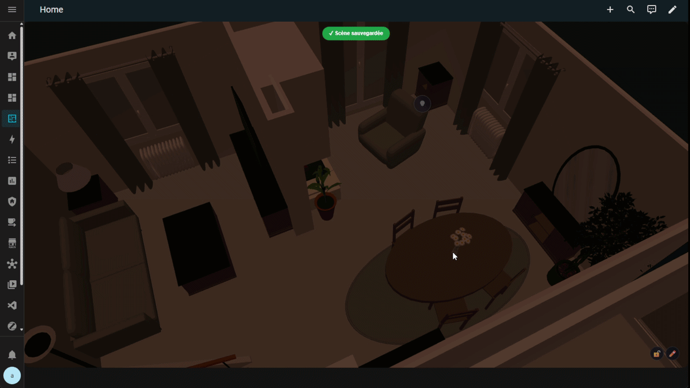
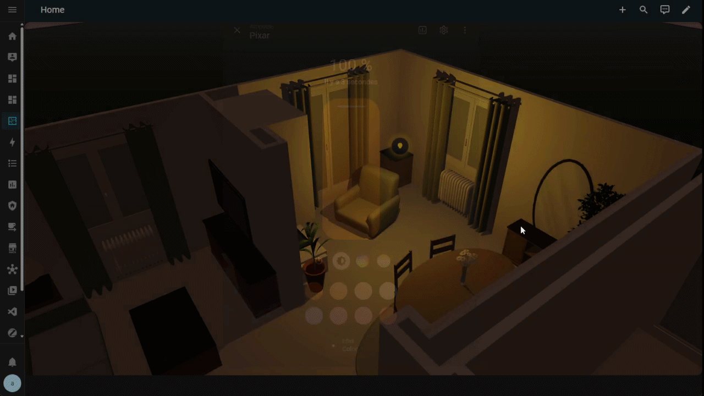
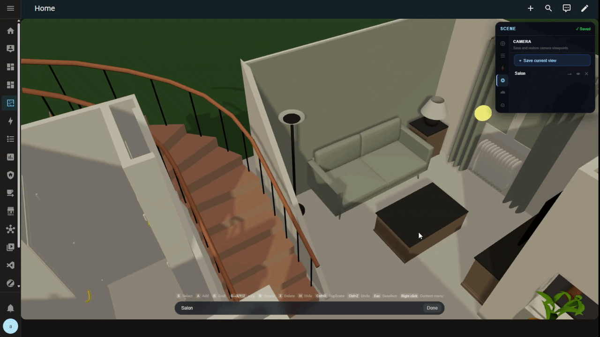
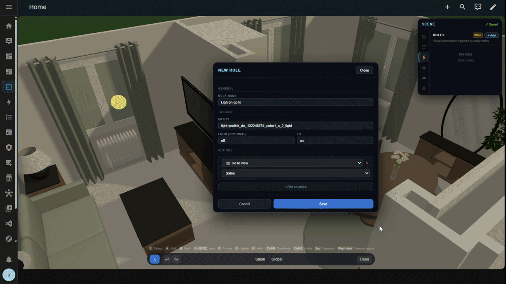
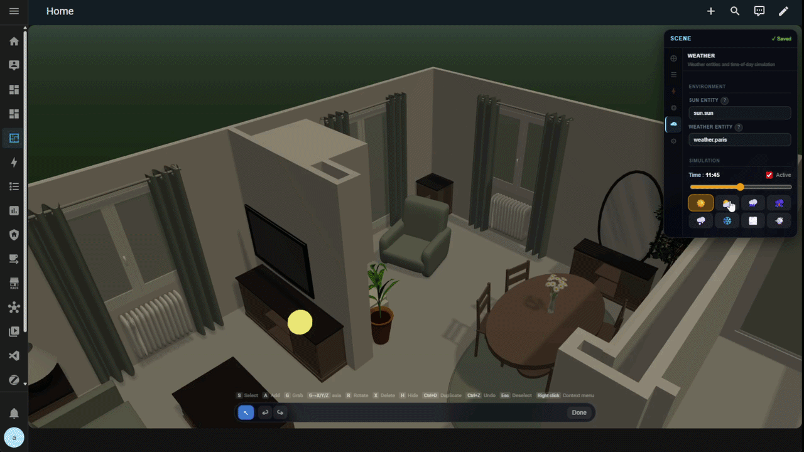

<p align="center">
  
</p>

<h1 align="center">Owlnest</h1>

<p align="center">
  <strong>Your home in 3D, right inside Home Assistant.</strong><br/>
  Load a 3D model, place your devices, control everything in real time.
</p>

<p align="center">
  <a href="#installation"></a>
  <a href="#installation"></a>
  <a href="https://github.com/MestrieEsteban/ha-owlnest/releases/latest"></a>
  <a href="LICENSE"></a>
</p>

<p align="center">
  <a href="#-features">Features</a> •
  <a href="#-installation">Installation</a> •
  <a href="#-quick-start">Quick start</a> •
  <a href="#-full-guide">Full guide</a> •
  <a href="#-faq">FAQ</a>
</p>

<p align="center">
  🌐 <a href="README-FR.md"><strong>Version française disponible ici</strong></a>
</p>

---

## 💬 Why Owlnest?

Existing 3D floorplan solutions for Home Assistant rely on static Blender renders: one image per light state, a new render for every color or condition. Nothing interactive, nothing alive.

I wanted something different: real-time 3D lights, a visual editor, weather effects, camera animations. Everything I wished existed. And I figured others might feel the same way, so I shared it.

<p align="center">
  
</p>

---

## ✨ Features

| | Feature | Description |
|---|---|---|
| 🏠 | **Interactive 3D scene** | Load any GLB/GLTF model and navigate freely with mouse or touch |
| 💡 | **Synchronized lights** | Your `light.*` entities drive real 3D lights — color, brightness, smooth transitions |
| 📍 | **Interactive anchors** | Tap to toggle, long-press for details. Supports lights, sensors, covers, climate, media players |
| 🃏 | **3D cards** | Floating info panels inside the scene — room summary, sensor values, action buttons |
| 🎥 | **Camera views** | Save named viewpoints and fly between them with smooth transitions |
| ⚡ | **Rules engine** | *Motion detected → fly to room*, *Door opened → show panel* |
| 🌦️ | **Dynamic weather** | Realistic sun from `sun.sun`, rain/snow/fog/storm particles from your weather entity |
| 🎨 | **Visual editor** | Configure everything in-scene, no YAML needed |
| 🌍 | **Multilingual** | English and French included |

---

## 📦 Installation

Owlnest has two parts:
- **Lovelace card** (frontend) — the JavaScript file
- **HA integration** (backend) — for scene persistence

### Via HACS (recommended)

> 1. Open **HACS** → **Frontend** → ⋮ menu → **Custom repositories**
> 2. Add `https://github.com/MestrieEsteban/ha-owlnest` with category **Plugin**
> 3. Search for **Owlnest 3D Floorplan** and install
> 4. Copy the `custom_components/owlnest/` folder to your `config/custom_components/` directory
> 5. **Restart** Home Assistant
> 6. Go to **Settings → Devices & Services → Add Integration** → search **Owlnest**

### Manual installation

> 1. Download `ha-3d-floorplan.js` from the [latest release](https://github.com/MestrieEsteban/ha-owlnest/releases/latest)
> 2. Place it in `config/www/ha-3d-floorplan.js`
> 3. Add it as a Lovelace resource: **Settings → Dashboards → Resources → Add**
>    - URL: `/local/ha-3d-floorplan.js`
>    - Type: JavaScript module
> 4. Copy `custom_components/owlnest/` to `config/custom_components/owlnest/`
> 5. **Restart** Home Assistant
> 6. Add the integration: **Settings → Devices & Services → Add → Owlnest**

### Requirements

- Home Assistant **2024.1** or later
- A **GLB** or **GLTF** 3D model (exported from Blender, Sweet Home 3D, SketchUp, etc.)

---

## 🚀 Quick start

### 1. Prepare your 3D model

Place your `.glb` file in the `config/www/models/` folder of your HA instance.

### 2. Add the card

On any dashboard, add a manual card:

```yaml
type: custom:owlnest-card
scene_id: my_home
model_url: /local/models/house.glb
```

### 3. Place your devices

1. Click the **✏️ pencil icon** to enter edit mode
2. In the **Anchors** tab, click **+ Add**
3. Pick an entity (e.g. `light.living_room`)
4. Click in the scene to place the anchor
5. Click **💾 Save**

> **Tip**: Press **G** to grab and move an anchor freely (Blender-style), then **X**, **Y** or **Z** to constrain to an axis.

---

## 📖 Full guide

### Scene navigation

| Action | Mouse | Touch |
|---|---|---|
| Orbit | Left-click + drag | One finger + drag |
| Zoom | Scroll wheel | Pinch |
| Pan | Right-click + drag | Two fingers + drag |

Navigation limits (min/max distance, max angle) are configurable in the editor's **Config** tab or via YAML:

```yaml
orbit:
  min_distance: 2
  max_distance: 20
  max_polar_angle: 85
```

---

### Anchors

Anchors are interactive points placed in the 3D scene. Each anchor is linked to a Home Assistant entity.

#### Supported domains

| Domain | Behavior | Visual |
|---|---|---|
| `light` | Creates a synchronized 3D light (color + brightness) | Light point with shadow |
| `switch` | On/off toggle | Switch icon |
| `sensor` | Displays real-time value | Label with value |
| `binary_sensor` | On/off indicator | Colored dot |
| `cover` | Reflects opening percentage | Progress indicator |
| `climate` | Mode indicator (heating/cooling) | Orange/blue based on action |
| `media_player` | Playing/paused indicator | Media icon |

#### Light styles

For `light` entities, three styles are available:

| Style | Description |
|---|---|
| `point` | Omnidirectional light (classic bulb) |
| `spot` | Directed cone beam (recessed spotlight) |
| `beam` | Narrow focused beam (projector) |

Style and direction are configured in the anchor properties in edit mode.

<p align="center">
  
</p>

#### Interactions

- **Short tap** → Toggle the entity (turn light on/off, open/close cover…)
- **Long press** → Open the Home Assistant `more-info` panel for the entity

#### Conditional visibility

Each anchor can be shown/hidden based on an entity's state:

> *Example: only show the bedroom temperature sensor when the door is open.*

Configure this in anchor properties → **Visible if** in the editor.

#### Advanced options

| Option | Description |
|---|---|
| `label` | Custom text displayed on the label |
| `icon` | Custom MDI icon (e.g. `mdi:thermometer`) |
| `precision` | Decimal places for sensors (e.g. `0` → "18", `1` → "17.6") |
| `lightIntensity` | Light intensity multiplier (default: 1) |

---

### 3D Cards

Cards are information panels that float inside the scene. They always face the camera (billboard).

#### Card types

| Type | Use case | Content |
|---|---|---|
| **Room** | Room summary | Icon + name + up to 4 entity states |
| **Entity** | Single device focus | Main state + unit + optional action button |
| **Info** | Static annotation | Icon + title + subtitle |

#### Sizes

| Size | 3D width |
|---|---|
| `small` | 0.6 meter |
| `medium` | 1.0 meter (default) |
| `large` | 1.5 meter |

#### Adding a card

1. Edit mode → **Cards** tab
2. Click **+ Add** and choose the type
3. Fill in the fields (name, entities, accent color…)
4. Use the gizmo to position the card in the scene

Cards also support **conditional visibility** (just like anchors).

---

### Camera views

Camera views let you save viewpoints and navigate between them with smooth animation.

#### Usage

1. Edit mode → **Camera** tab (or click the 📷 icon in the toolbar)
2. Position the camera where you want
3. Click **Capture view** and give it a name
4. The view appears in the navigation bar at the bottom of the scene

#### Hidden views

A view can be marked as **hidden**: it won't appear in the navigation bar but remains available for rules (e.g. "fly to the kitchen when motion is detected").

<p align="center">
  
</p>

---

### Rules engine

Rules let you create visual automations internal to the 3D scene.

#### Rule structure

```
WHEN   [trigger]       →  a state change occurs
IF     [conditions]    →  all conditions are true (optional)
THEN   [actions]       →  execute one or more actions
```

#### Triggers

| Type | Description |
|---|---|
| **State change** | Fires when an entity's state changes. Optional `from` and `to` filters |

*Example: "When `binary_sensor.living_room_motion` changes from `off` to `on`"*

#### Conditions

Conditions gate execution (AND logic: all must be true).

| Operator | Description |
|---|---|
| `=` | Equal |
| `≠` | Not equal |
| `>` `<` `≥` `≤` | Numeric comparisons |
| `contains` | Text contains value |

Each condition can be **negated** ("Hide if" mode).

#### Actions

| Action | Description |
|---|---|
| **Go to view** | Animate camera to a saved viewpoint |
| **Show card** | Make a 3D card visible |
| **Hide card** | Hide a 3D card |
| **Call service** | Call an HA service (e.g. `light.turn_on`, `notify.mobile`) |

#### Concrete example

> **Rule "Intrusion alert"**
> - Trigger: `binary_sensor.front_door` changes to `on`
> - Condition: `alarm_control_panel.home` = `armed_away`
> - Actions:
>   - Go to view "Entrance"
>   - Show card "Door alert"

<p align="center">
  
</p>

---

### Environment

Owlnest can synchronize ambient lighting and weather effects with your Home Assistant entities.

#### Sun

Set `sun_entity: sun.sun` to have sunlight follow the real sun position.

| Mode | Description |
|---|---|
| **Showcase** | Soft, flattering light — ideal for presentation |
| **Realistic** | Accurate sun position, accounting for house orientation |

In **realistic** mode, set `house_orientation` (in degrees) to align your model's north with real north:
- `0` = model front faces north
- `90` = model front faces east

#### Weather

Set `weather_entity: weather.home` for dynamic visual effects:

| HA state | Visual effect |
|---|---|
| Sunny / Clear night | No effect |
| Cloudy | Dimmed light, light haze |
| Rain | Rain particles |
| Pouring | Heavy rain |
| Thunderstorm | Rain + lightning flashes |
| Snow | Snow particles |
| Fog | Dense fog |
| Hail | Hail particles |
| Wind | Wind effect |

#### Simulator

The simulator (⏰ icon in the toolbar) lets you preview lighting at different times and weather conditions, without affecting real entities.

#### Sky

Enable `sky: true` to display a realistic atmospheric sky that follows the sun position (colorful sunrise/sunset, dark night).

<p align="center">
  
</p>

---

### Rendering and appearance

All rendering settings are configurable in the editor's **Config** tab.

| Setting | Description | Default |
|---|---|---|
| `shadows` | Enable shadow casting | `false` |
| `exposure` | Global brightness (tone mapping) | — |
| `fog_density` | Ambient fog density | `0.018` |
| `transparent_background` | Transparent background (see-through to dashboard) | `false` |
| `sky` | Atmospheric sky | `false` |
| `sun_intensity` | Sun light intensity | `0.8` |
| `ambient_intensity` | Ambient light intensity | `0.7` |
| `light_occlusion` | Prevent sunlight entering through open roof | `none` |

#### Ground styles

| Style | Description |
|---|---|
| `none` | No ground |
| `square` | Square plane |
| `disc` | Circular disc |
| `infinite` | Infinite plane |
| `podium` | Raised pedestal |

Ground color and scale are configurable via `ground_color` and `ground_scale`.

---

### Keyboard shortcuts (edit mode)

| Key | Action |
|---|---|
| **S** | Selection tool |
| **G** | Grab mode (free movement) |
| **X** / **Y** / **Z** | Constrain movement to axis |
| **Ctrl+Z** | Undo |
| **Ctrl+Shift+Z** | Redo |
| **Delete** | Delete selected anchor |

---

### Full YAML reference

Here are all available options:

```yaml
type: custom:owlnest-card
scene_id: my_home
model_url: /local/models/house.glb

# Environment entities
sun_entity: sun.sun
weather_entity: weather.home

# Navigation
orbit:
  min_distance: 2
  max_distance: 20
  max_polar_angle: 85

# Lights
lights:
  distance: 8
  decay: 2
  transition: 0.4

# Rendering
rendering:
  shadows: true
  sky: true
  exposure: 1.0
  fog_density: 0.018
  sun_mode: realistic
  house_orientation: 45
  sun_intensity: 0.8
  ambient_intensity: 0.7
  ground_style: disc
  ground_color: '#1a1a2e'
  ground_scale: 1.0
  light_occlusion: none
  transparent_background: false

# UI
height: 600
tap_to_toggle: true
cluster_threshold: 50

ui:
  show_simulation: true
  show_editor: true
  show_lock: true
  show_capture: true
```

> **Note**: Most of these options can be configured directly from the visual editor. YAML is only needed for initial setup (`scene_id` and `model_url`).

---

## ❓ FAQ

<details>
<summary><strong>Where can I get a 3D model of my home?</strong></summary>

You can create your model with:
- **Sweet Home 3D** (free, simple) → export as OBJ then convert to GLB with Blender
- **Blender** (free, advanced) → export directly to GLB
- **SketchUp** (freemium) → export via GLTF plugin
- **Floorplanner.com** (online) → export and convert

The recommended format is **GLB** (binary GLTF) for optimal performance.
</details>

<details>
<summary><strong>My model doesn't show up</strong></summary>

- Make sure the file is in `config/www/` and accessible via `/local/...`
- Check the URL in the config (no spaces, correct extension)
- Open the browser console (F12) to see errors
- Test your GLB file on [gltf-viewer.donmccurdy.com](https://gltf-viewer.donmccurdy.com/) to verify it's valid
</details>

<details>
<summary><strong>Lights don't respond</strong></summary>

- The anchor must be linked to a `light.*` domain entity
- Verify the entity exists in Home Assistant (**Developer Tools → States**)
- Make sure the Owlnest integration is installed and active
</details>

<details>
<summary><strong>Scene doesn't save</strong></summary>

- The backend integration must be installed: **Settings → Devices & Services** → check that **Owlnest** appears
- A `scene_id` must be set in the card configuration
- Check the browser console for WebSocket errors
</details>

<details>
<summary><strong>Can I have multiple scenes?</strong></summary>

Yes! Each card can have a different `scene_id`. You can have one scene per floor, per room, or per building.
</details>

<details>
<summary><strong>The model is too big / too small</strong></summary>

Owlnest uses the 3D model's units as-is. If your model is at scale in Blender (1 unit = 1 meter), it will be the right size. Otherwise, resize it in your 3D software before exporting.
</details>

<details>
<summary><strong>Can I use custom MDI icons?</strong></summary>

Yes! In anchor properties, set the `icon` field to any MDI icon (e.g. `mdi:thermometer`, `mdi:door-open`). The full list is at [pictogrammers.com/library/mdi](https://pictogrammers.com/library/mdi/).
</details>

<details>
<summary><strong>Performance is poor</strong></summary>

- Reduce your 3D model complexity (polygon count)
- Disable shadows (`shadows: false`)
- Disable the atmospheric sky (`sky: false`)
- Turn off weather effects if unused
</details>

---

## 🤝 Contributing

Contributions are welcome! Feel free to open an [issue](https://github.com/MestrieEsteban/ha-owlnest/issues) to report bugs or suggest features.

---

## 📄 License

[MIT](LICENSE) — Esteban Mestrie
